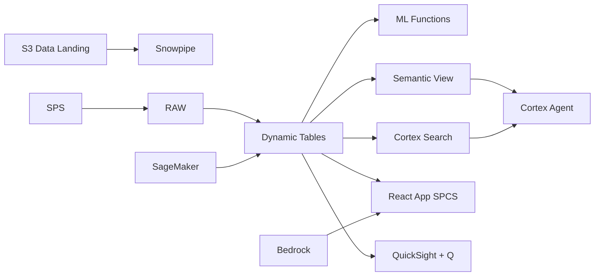

# Production Capacity Planning

Production Capacity Planning for Vietnam - ML.FORECAST and Dynamic Tables power real-time capacity planning intelligence for electronics manufacturing in Thai Nguyen & Hai Phong.

## Architecture

Vietnam electronics manufacturing faces increasing complexity in capacity planning. Decision-makers in Thai Nguyen & Hai Phong need real-time intelligence and ML-powered recommendations.



## Snowflake Capabilities

| Capability | Implementation |
|-----------|---------------|
| Dynamic Tables | PERFORMANCE_DASHBOARD / TREND_ANALYTICS / FORECAST_INPUT / OPERATIONAL_RISK |
| ML Functions | ML.FORECAST + ML.ANOMALY_DETECTION |
| Cortex AI | COMPLETE, SUMMARIZE, AI_CLASSIFY |
| Cortex Search | 100 documents indexed |
| Cortex Agent | ELECTRONICS_CAPACITY_AGENT |
| Semantic View | ELECTRONICS_CAPACITY_ANALYTICS |
| React App (SPCS) | 5 tabs + DemoGuide |


## AWS Services

| Service | Role in Demo |
|---------|-------------|
| AWS IoT Core | Ingest real-time data from electronics manufacturing systems |
| Amazon SageMaker | Capacity Planning ML models |
| AWS Glue | ETL and data transformation |
| Apache Iceberg (S3) | Open table format for data sharing |
| Amazon Bedrock (Claude) | Generate capacity planning recommendations |
| Amazon QuickSight + Q | Capacity Planning dashboard with NL queries |


## Personas

| Persona | Role | Key Questions |
|---------|------|---------------|
| **Tran Quoc Viet** | VP Manufacturing | "What are the key capacity planning metrics?" "Which areas need attention?" |
| **Nguyen Thi Mai** | Planning Manager | "Show me the trend analysis." "Which operations are underperforming?" |


## Data

| Table | Rows | Description |
|-------|------|-------------|
| OPERATIONS | 100,000 | Core operational records for capacity planning |
| METRICS | 500,000 | Time-series performance metrics |
| ASSETS | 5,000 | Asset and entity master data |
| EVENTS | 200,000 | Operational events and incidents |
| DOCUMENTS | 100 | SOPs, reports, and compliance docs |


## Build Instructions

### Prerequisites
- Snowflake account with ACCOUNTADMIN access
- Cortex AI enabled (ML Functions, Search, Agent)
- Warehouse: ELECTRONICS_WH (Medium)
- AWS CLI with access (us-west-2)

### Deployment

```bash
snowsql -f snowflake/00_setup.sql
snowsql -f snowflake/01_marketplace_install.sql
snowsql -f snowflake/02_raw_tables.sql
snowsql -f snowflake/03_staging.sql
snowsql -f snowflake/04_dynamic_tables.sql
snowsql -f snowflake/05_search.sql
snowsql -f snowflake/06_ml_models.sql
snowsql -f snowflake/07_semantic_view.sql
snowsql -f snowflake/08_agent.sql
```

### React App (SPCS)
```bash
cd app && npm ci && npm run build
docker build -t aws-vietnam-electronics-capacity-app .
docker push bdiqc8sm-default.registry.snowflakecomputing.com/electronics_capacity/app/aws_vietnam_electronics_capacity/app:latest
```

### Demo Mode
Open the app URL with `?demo=true` for presenter view.

## Build Modes

### Snowflake Only
Run scripts 00-08 (skip AWS-specific integration). Uses:
- **Snowpipe Streaming SDK** instead of AWS IoT Core
- **ML.FORECAST + ML.ANOMALY_DETECTION** instead of Amazon SageMaker
- **Dynamic Tables** instead of AWS Glue
- **Snowflake-managed Iceberg Tables** instead of Apache Iceberg (S3)
- **Cortex Complete** instead of Amazon Bedrock (Claude)
- **Snowflake Intelligence (Cortex Analyst)** instead of Amazon QuickSight + Q

### Full AWS + Snowflake
Run all scripts including AWS integration. Deploy QuickSight dashboard from `quicksight/`.

## Business Impact

Industry research and Snowflake customer outcomes:
- **Vietnam attracted $4.3B FDI in electronics manufacturing in 2024 — Intel, LG, Foxconn, and Pegatron expanding** — [MPI Vietnam FDI Portal](https://fdi.gov.vn/)
- **Factory capacity utilization in Bac Ninh electronics cluster averages 78% — optimal is 85-92%** — [Vietnam Electronics Industries Association](https://veia.org.vn/)
- **Unplanned downtime costs electronics manufacturers $260,000/hour on average — predictive analytics reduces incidents 35%** — [Deloitte Smart Factory](https://www2.deloitte.com/us/en/insights/focus/industry-4-0/smart-factory-connected-manufacturing.html)
- **Flex Ltd uses Snowflake to unify production data across 100+ manufacturing sites globally** — [Snowflake Customers](https://www.snowflake.com/en/customers/all-customers/)

## Key Demo Numbers

- **100K operations** tracked in Thai Nguyen & Hai Phong
- **500K metrics** time-series data points
- **5K assets** monitored
- **100 docs** searchable


## License

Apache 2.0 — See [LICENSE](LICENSE) for details.

This is a personal demo project and is not an official Snowflake offering. It comes with no support or warranty.